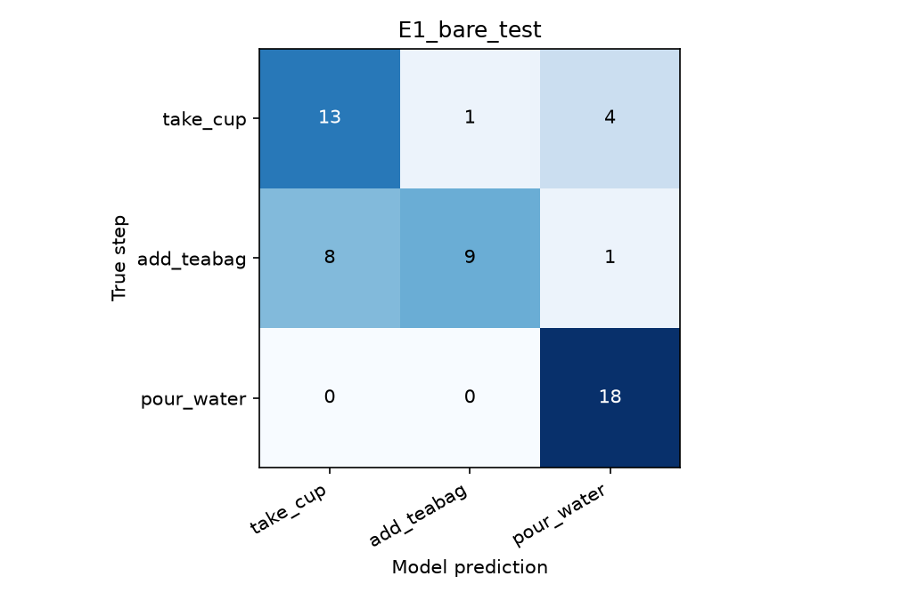

# procedure-vlm-eval

**Can a vision-language model tell which step of a procedure someone is on from a single video frame?**

This project builds a labelled evaluation set from the [Breakfast Actions dataset](https://serre.lab.brown.edu/breakfast-actions-dataset.html), runs a vision-language model over it through a Python harness, scores the results against a majority-class baseline, and tests how prompt design and added context change accuracy.

It is a small-scale version of a real problem: a system watching someone carry out a multi-step procedure — a lab protocol, say — and working out what step they are on.

**Headline result:** Gemini 3.1 Flash-Lite reached **74.1% accuracy** on a held-out test set of 54 frames, against a **33.3% baseline**. Every attempt to help the model with extra context made it worse, and accuracy depended far more on whether a frame was legible at all than on the prompt.

---

## Contents

- [Task](#task)
- [Dataset](#dataset)
- [Method](#method)
- [Results](#results)
- [What surprised me](#what-surprised-me)
- [Limitations](#limitations)
- [Repository structure](#repository-structure)
- [To reproduce](#to-reproduce)
- [Citation](#citation)

---

## Task

Given one frame from a video of someone making tea, predict which step is shown.

| Step label | Meaning |
|---|---|
| `take_cup` | Reaching for, picking up or putting down an empty cup |
| `add_teabag` | Taking a teabag from a box and putting it in the cup |
| `pour_water` | Pouring hot water from a kettle into the cup |

The model must answer in a fixed JSON schema:

```json
{"step": "pour_water", "confidence": 0.82}
```

Rarer steps (`spoon_sugar`, `pour_sugar`, `stir_tea`, each appearing in fewer than 15 segments) and background frames (`SIL`) were excluded, because accuracy on so few examples would not be meaningful.

---

## Dataset

**Source:** Breakfast Actions dataset (Kuehne, Arslan & Serre, CVPR 2014), CC BY 4.0. Roughly 1,700 videos of 52 people preparing breakfast items in 18 kitchens, at 320×240 and 15 fps, with timestamped action segments.

**What this project uses:** the tea activity only, one camera view per participant so the same session is never counted twice, giving **51 independent sessions**.

| Split | Participants | Frames | Balance |
|---|---|---|---|
| Dev (prompt development) | 15 | 35 | unbalanced (5 / 15 / 15) |
| Test (held out) | 36 | 54 | balanced, 18 per step |

Frames were sampled from the **middle** of each labelled segment to avoid ambiguous boundaries, one frame per segment so no two frames are near-duplicates. Splits are by participant, so no person appears in both.

**Label verification.** All 89 frames were hand-checked for whether a human could identify the step from that image alone:

| | `yes` | `unclear` | `no` |
|---|---|---|---|
| `pour_water` | 32 | 1 | 0 |
| `add_teabag` | 13 | 12 | 8 |
| `take_cup` | 9 | 5 | 9 |
| **Total** | **54 (61%)** | **18** | **17** |

This gives a rough human ceiling for single-frame recognition and is used in the analysis below. The verdicts are stored in the `verified` column of `labels/labels.csv`.

---

## Method

1. **`build_dataset.py`** parses the dataset's segment annotations, picks one camera per participant, samples the middle frame of each usable segment, splits by participant, balances the test split, extracts frames with OpenCV and writes `labels/labels.csv`. A fixed random seed makes the dataset reproducible.
2. **`run_model.py`** sends each frame to a vision model with an experiment's prompt and appends every answer to `results/raw/<experiment>.jsonl`, including the raw text and any errors. It resumes after interruptions, paces itself for the free-tier rate limit and retries temporary failures.
3. **`prompts.py`** holds every prompt variant, so each experiment is defined in one place.
4. **`score.py`** joins predictions to labels and reports accuracy with a confidence interval, balanced accuracy, per-step accuracy, invalid-output rate, accuracy split by frame legibility, confidence calibration, and a confusion matrix.

Unparseable answers and unknown step names are counted as **wrong**, never dropped.

---

## Results

*Model: Gemini 3.1 Flash-Lite (free tier) · September 2026*

### Held-out test set

| Setup | Accuracy | Balanced accuracy | Invalid outputs |
|---|---|---|---|
| Majority-class baseline | 33.3% | 33.3% | — |
| **E1: bare prompt** | **74.1%** (95% CI 61.1–83.9) | 74.1% | 0% |
| **E5: + step descriptions** | **74.1%** (95% CI 61.1–83.9) | 74.1% | 0% |

Both prompts beat the baseline by about 41 points. Across 108 test requests, not one answer was invalid or unparseable, so the JSON output schema held up completely.



### Prompt and context experiments (development set)

All variants were developed on the dev participants only; the two best were then run once on the held-out test participants.

| Experiment | What changed | Accuracy | Balanced accuracy |
|---|---|---|---|
| Baseline | Always predict most common step | 42.9% | 33.3% |
| **E1** | Bare prompt: image + step names | **85.7%** | **88.9%** |
| E5 | + step descriptions | 80.0% | 80.0% |
| E2 | + step descriptions and ordering hint | 80.0% | 75.6% |
| E3 | Bare prompt + frame from 2 s earlier | 80.0% | 66.7% |
| E4 | Descriptions, ordering hint and earlier frame | 77.1% | 64.4% |

### Findings

**1. Added context consistently hurt, and stronger temporal cues hurt more.** Every variant scored below the bare prompt on dev, and balanced accuracy fell steadily as the ordering cue got stronger: none (E1, 88.9%), implicit in the step descriptions (E5, 80.0%), an explicit ordering sentence (E2, 75.6%), and an earlier frame showing that time had already passed (E3/E4, around 65%). The mechanism was consistent: ordering cues pushed the model away from the first step. `take_cup` accuracy fell from 100% (E1) to 80% (E5), 60% (E2) and 20% (E3/E4), while `add_teabag` rose from 66.7% to as high as 86.7%. E5 was added specifically to separate the step descriptions from the ordering sentence; the sentence alone accounted for a 20-point share of the `take_cup` drop.

**2. The bare prompt's dev advantage did not replicate.** E1 beat E5 by 5.7 points on dev but tied it exactly on test (74.1% each). On 35 dev frames, that gap was worth two frames, well inside the confidence interval. The two prompts agreed on 47 of 54 test frames (87%), so identical accuracy came from slightly different behaviour rather than identical answers.

**3. Accuracy is governed by frame legibility, not by the model.** Using the hand-checked verdicts, E1 scored **96.8%** on the 31 clearly legible test frames but **43.5%** on the 23 ambiguous ones, barely above the 33.3% baseline. `pour_water`, which is visually unmistakable, was correct in all 18 test frames under both prompts.

**4. Most errors are a labelling-granularity artefact, not misperception.** The dominant confusion was `add_teabag` predicted as `take_cup` (8 of 14 E1 test errors). Those frames show the person holding or moving the cup with the teabag out of view: the model reads the visible evidence correctly, but the ground-truth label covers a whole activity segment, parts of which contain no visible teabag. Segments are long enough for this to be common — one `add_teabag` segment runs 45 seconds.

**5. Confidence scores do not flag errors.** Mean confidence was 0.90 when correct and 0.84 when wrong on test. Four of the five dev errors came with confidence of 0.85 or above, one at 0.95. Confidence is not usable as a filter here.

---

## What surprised me

- **More context made things worse.** I expected that telling the model the procedure would help, since that is the obvious thing to try. Instead every version of it lowered balanced accuracy, and the most effective prompt was the shortest one.
- **The model's mistakes were often more defensible than the labels.** Looking at the failures changed how I read the accuracy number: many "wrong" answers describe the frame correctly and disagree only with how the segment was annotated.
- **A 5.7-point improvement on dev evaporated on test.** Seeing a difference I would have been happy to report turn out to be noise made the value of a held-out split concrete rather than theoretical.
- **The output schema never broke.** I expected to spend time repairing malformed JSON, but across roughly 300 requests there were no parse failures at all.
- **Hand-labelling was the most informative part.** Checking all 89 frames myself produced the human ceiling that makes the 43.5% ambiguous-frame result interpretable, and it taught me more about the data than any metric did.

---

## Limitations

- **Small evaluation set.** 54 test frames gives a 95% confidence interval of roughly ±12 points, so differences under about 10 points are not meaningful. The dev/test discrepancy demonstrates this directly.
- **Label granularity mismatch.** Ground-truth segments annotate activities spanning many seconds, while a single frame may not show the defining action. 17 of 89 sampled frames were ones I could not identify myself.
- **Single frames only.** Steps distinguished by motion rather than appearance have a hard ceiling in this setup.
- **Low resolution.** 320×240 at 15 fps makes teabags and other small objects hard to see.
- **Three steps only.** Rarer steps and background frames were excluded. A deployed system would also need to recognise "no step in progress".
- **One model, one point in time.** Results are specific to Gemini 3.1 Flash-Lite and may not transfer. Outputs are not fully deterministic, so small differences may vary between runs.
- **Kitchen domain.** Lab procedures involve different equipment and finer distinctions between steps.
- **Prompt variants were run once each**, so run-to-run variation is not separated from prompt effects.

---

## Repository structure

```
procedure-vlm-eval/
├── README.md
├── requirements.txt
├── .env.example            # API key template (.env itself is git-ignored)
├── .gitignore
├── data/                   # not committed (videos, frames, annotations)
│   ├── BreakfastII_15fps_qvga_sync/
│   ├── segmentation_coarse/
│   ├── frames/             # 89 extracted evaluation frames
│   └── frames_prev/        # earlier frames used by E3/E4
├── labels/
│   └── labels.csv          # the evaluation set: frame, split, step, verified
├── results/
│   ├── raw/                # one JSONL of model responses per experiment
│   ├── predictions/        # per-frame scored results
│   ├── figures/            # confusion matrices
│   └── metrics.csv         # one row per experiment
└── src/
    ├── build_dataset.py    # parse annotations, sample and extract frames
    ├── check_labels.py     # inspect the annotation files
    ├── list_models.py      # list models available to the API key
    ├── prompts.py          # all prompt variants
    ├── run_model.py        # the evaluation harness
    └── score.py            # metrics, baseline, confusion matrices
```

---

## To reproduce

```bash
cd procedure-vlm-eval
python3 -m venv .venv && source .venv/bin/activate
pip install -r requirements.txt
cp .env.example .env        # add a Gemini API key from aistudio.google.com/apikey
```

Download the tea videos and coarse segmentation annotations from the dataset page into `data/`, then:

```bash
python3 src/build_dataset.py                    # build the evaluation set
python3 src/score.py --baseline --split test    # baseline
python3 src/run_model.py E1_bare --split dev    # run an experiment
python3 src/score.py E1_bare --split dev        # score it
```

`run_model.py` resumes where it left off, so it is safe to rerun if the free tier rate-limits it. Add `--dry-run` to test the pipeline without API calls, or `--provider claude` to use the Anthropic API instead.

---

## Citation

Data from the Breakfast Actions dataset (CC BY 4.0):

> H. Kuehne, A. B. Arslan and T. Serre. *The Language of Actions: Recovering the Syntax and Semantics of Goal-Directed Human Activities.* CVPR, 2014.
